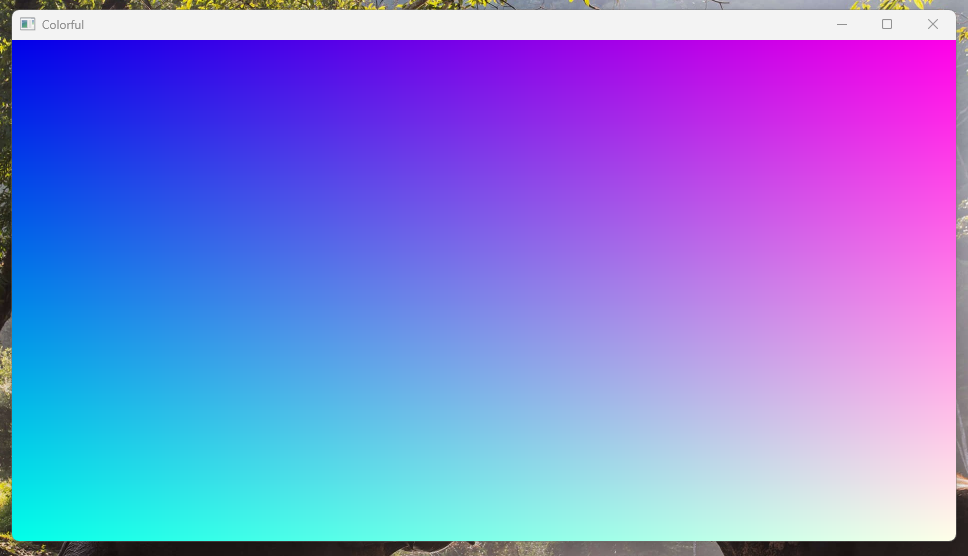

# Colorful

Demonstrates the use of shader binding



## The Pixel Shader

```hlsl
cbuffer Args : register(b0)
{
    float time;
} 

[shader("pixel")]
float4 Pixel(Varying input) : SV_Target
{
    return float4(input.Uv, (cos(time) + 1) * 0.5, 1);
}
```

## 2 LoadResources
```cs
var modules = await LoadShaderModules("Shader", [ShaderStage.Vertex, ShaderStage.Pixel]);

// Defines the shader layout. 
// This rhi does not provide shader compilation and reflection related features, and needs to be provided by the user.
Layout = Device.CreateShaderLayout(
    [
        new()
        {
            Slot = 0,                                       // Dx: hlsl register; Vk: binding or push const offset when View is Constants
            Stage = ShaderStage.Pixel,                      // Can only be bound to a single shader stage
            View = ShaderLayoutItemView.Cbv,                // View type, Cbv Srv Uav Sampler Constants
            Type = ShaderLayoutItemType.ConstantBuffer,     // Resource type, use hlsl style, ConstantBuffer StructureBuffer Texture2D etc
            Usage = ShaderLayoutItemUsage.Persist,          // Resource binding change frequency
            // Dynamic: may change every frame
            // Persist：rarely changes, such as material parameters
            // Instant：only buffer and sampler, when buffer mean may change every draw, when sampler it is static sampler
            // View type is Constants will ignore Usage
            UavAccess: ResourceAccess.Unknown,              // Unknown ReadOnly WriteOnly ReadWrite
            // Not necessary, can optimize automatic barriers
        }
    ],
    Name: Name
);

Shader = Device.CreateShader(modules, Layout);
Pipeline = Device.CreateGraphicsShaderPipeline(... Omitted here);

// Shader Binding instance, maybe it's similar to webgpu's bindgroup, but allows dynamic changes
ShaderBinding = Device.CreateShaderBinding(Layout, Name: Name);

// Create argument buffer
ArgBuffer = Device.CreateBuffer(
    new()
    {
        Purpose = ResourcePurpose.ConstantBuffer,
        Size = sizeof(float),
    },
    Name: "Args"
);
// Bind it
cmd.Bind(ShaderBinding, [new(0, ArgBuffer)]);
```

## 3 Render
```cs
// Write time data
cmd.Upload(ArgBuffer, [(float)time.Total.TotalSeconds]);
using var render = cmd.Render([new(Output, new Color(0.83f, 0.8f, 0.97f, 1f))]);
render.Draw(Pipeline, 4, Binding: ShaderBinding);
```
