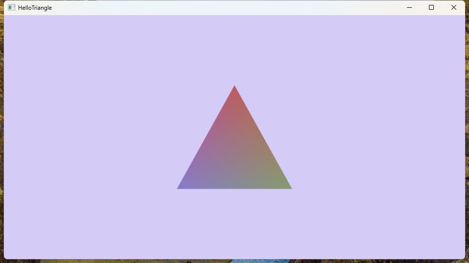

# HelloTriangle

The most basic usage, basic swap chain creation, pipeline creation.  
No any resources, including vertex buffers.  



## 1 InitGraphics

```cs
// Load an instance of the specified backend
Graphics = GraphicsInstance.LoadD3d12();
// Creating a Graphics Device
Device = Graphics.CreateDevice(Debug: true, Name: "Main Device");
// Get the main isolate of the device, isolate contains multiple queues internally
Isolate = Device.MainIsolate;
// Creating a swap chain
Output = Isolate.CreateSwapChainForHwnd(new() { Width = Width, Height = Height }, Hwnd);
// Rent command recording object
Record = Isolate.RentRecord();
```

## 2 LoadResources
```cs
// See the source code for details
// This shader module is not a vk module. A module can only have one shader stage with one entrypoint.
// The main purpose is to use native memory to store data to avoid complex memory pinning.
var modules = await LoadShaderModules("Shader", [ShaderStage.Vertex, ShaderStage.Pixel]);
// To create a shader, you need to provide the shader stages (shader module)
// and the binding layout, input layout (if have vertex shader).
Shader = Device.CreateShader(modules, null, Device.CreateShaderInputLayout([]));
// Then create a pipeline using the graphics state
Pipeline = Device.CreateGraphicsShaderPipeline(
    Shader, new()
    {
        DsvFormat = GraphicsFormat.Unknown,
        BlendState =
        {
            Rt0 =
            {
                Src = BlendType.SrcAlpha,
                Dst = BlendType.InvSrcAlpha,
                Op = BlendOp.Add,
            }
        }
    }, Name: "HelloTriangle"
);
```

## 3 Render
```cs
while (!IsClosed)
{
   Render(Record, CalcTime());
   // Split PreparePresent and Present so that Present can be done on a separate thread
   Record.PreparePresent(Output);
   // Recording objects can be reused immediately after submission
   Isolate.Submit(Record);
   // Present is a combination of PresentNoWait and Wait
   // Using them separately can wait for multiple outputs in batches
   Output.Present();
}

void Render(GpuRecord cmd, Time time)
{
    using var render = cmd.Render([new(Output, new Color(0.83f, 0.8f, 0.97f, 1f))]);
    render.Draw(Pipeline, 3);
}
```
