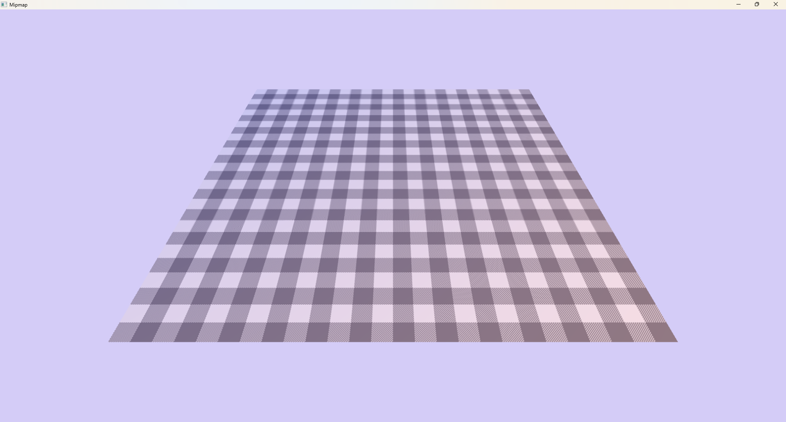

# Mipmap

Demonstrate the use of compute shaders and dynamic groups
  - Generate mipmaps using compute shaders, use wave shuffling and group sharing to process multiple mipmap levels in a single dispatch



## The Mipmap Shader

<details>
  <summary>The Mipmap Shader</summary>

```hlsl
cbuffer Args : register(b0)
{
    uint2 size;
    uint mip_levels; // 0 .. 4
    uint arr;
}

RWTexture2D<float4> images[] : register(u0);

groupshared float tmp_r[8][8];
groupshared float tmp_g[8][8];
groupshared float tmp_b[8][8];
groupshared float tmp_a[8][8];

void StoreColor(uint2 pos, float4 color)
{
    tmp_r[pos.y][pos.x] = color.r;
    tmp_g[pos.y][pos.x] = color.g;
    tmp_b[pos.y][pos.x] = color.b;
    tmp_a[pos.y][pos.x] = color.a;
}

float4 LoadColor(uint2 pos)
{
    return float4(
        tmp_r[pos.y][pos.x],
        tmp_g[pos.y][pos.x],
        tmp_b[pos.y][pos.x],
        tmp_a[pos.y][pos.x]
    );
}

void X8_8(uint2 gtid, uint2 gid, inout uint index, inout float4 color);
void X4_4(uint2 gtid, uint2 gid, inout uint index, inout float4 color);
void X2_2(uint2 gid, inout uint index, inout float4 color);

[shader("compute")]
[numthreads(8, 8, 1)]
void Compute(uint2 tid : SV_DispatchThreadID, uint2 gtid : SV_GroupThreadID, uint2 gid: SV_GroupID)
{
    uint index = 1;

    float4 color; // cur pixel color
    switch (mip_levels)
    {
    case 4:
        {
            uint2 pos = 2 * tid;
            RWTexture2D<float4> src = images[0]; // 16x16
            RWTexture2D<float4> dst = images[1]; // 8x8
            color = (
                src.Load(pos + uint2(0, 0)) +
                src.Load(pos + uint2(0, 1)) +
                src.Load(pos + uint2(1, 0)) +
                src.Load(pos + uint2(1, 1))
            ) * 0.25;
            dst[tid] = color;
            index = 2;
            X8_8(gtid, gid, index, color);
            return;
        }
    case 3:
        {
            uint2 base = gid * 8;
            uint2 pos = base + gtid;
            RWTexture2D<float4> src = images[0]; // 8x8
            color = src.Load(pos);
            X8_8(gtid, gid, index, color);
            return;
        }
    case 2:
        {
            if (any(gtid >= 4)) return;
            uint2 base = gid * 4;
            uint2 pos = base + gtid;
            RWTexture2D<float4> src = images[0]; // 4x4
            color = src.Load(pos);
            X4_4(gtid, gid, index, color);
            return;
        }
    case 1:
        {
            if (any(gtid >= 2)) return;
            uint2 base = gid * 2;
            uint2 pos = base + gtid;
            RWTexture2D<float4> src = images[0]; // 2x2
            color = src.Load(pos);
            X2_2(gid, index, color);
        }
    default:
        return;
    }
}

bool QuadIsFirst()
{
    return WaveGetLaneIndex() % 4 == 0;
}

void X8_8(uint2 gtid, uint2 gid, inout uint index, inout float4 color)
{
    if (index > arr) return;
    RWTexture2D<float4> dst = images[index]; // 4x4
    // color from 8x8
    float4 c1 = QuadReadAcrossX(color);
    float4 c2 = QuadReadAcrossY(color);
    float4 c3 = QuadReadAcrossDiagonal(color);
    float4 dst_color = (color + c1 + c2 + c3) * 0.25;
    bool can_wave = WaveGetLaneCount() >= 64;
    if (QuadIsFirst())
    {
        uint2 base = gid * 4;
        uint2 pos = gtid / 2;
        dst[base + pos] = dst_color;
        if (!can_wave) StoreColor(pos, dst_color);
    }
    if (!can_wave)
    {
        GroupMemoryBarrierWithGroupSync();
        if (any(gtid >= 4)) return;
        color = LoadColor(gtid);
    }
    else
    {
        if (all(gtid < 4))
        {
            color = WaveReadLaneAt(dst_color, WaveGetLaneIndex() * 4);
        }
        if (any(gtid >= 4)) return;
    }
    index++;
    X4_4(gtid, gid, index, color);
}

void X4_4(uint2 gtid, uint2 gid, inout uint index, inout float4 color)
{
    if (index > arr) return;
    RWTexture2D<float4> dst = images[index]; // 2x2
    // color from 4x4
    float4 c1 = QuadReadAcrossX(color);
    float4 c2 = QuadReadAcrossY(color);
    float4 c3 = QuadReadAcrossDiagonal(color);
    float4 dst_color = (color + c1 + c2 + c3) * 0.25;
    bool can_wave = WaveGetLaneCount() >= 32;
    if (QuadIsFirst())
    {
        uint2 base = gid * 2;
        uint2 pos = gtid / 2;
        dst[base + pos] = dst_color;
        if (!can_wave) StoreColor(pos, dst_color);
    }
    if (!can_wave)
    {
        GroupMemoryBarrierWithGroupSync();
        if (any(gtid >= 2)) return;
        color = LoadColor(gtid);
    }
    else
    {
        if (all(gtid < 2))
        {
            color = WaveReadLaneAt(dst_color, WaveGetLaneIndex() * 2);
        }
        if (any(gtid >= 2)) return;
    }
    index++;
    X2_2(gid, index, color);
}

void X2_2(uint2 gid, inout uint index, inout float4 color)
{
    if (index > arr) return;
    RWTexture2D<float4> dst = images[index]; // 1x1
    // color from 2x2
    float4 c1 = QuadReadAcrossX(color);
    float4 c2 = QuadReadAcrossY(color);
    float4 c3 = QuadReadAcrossDiagonal(color);
    float4 dst_color = (color + c1 + c2 + c3) * 0.25;
    if (QuadIsFirst())
    {
        dst[gid] = dst_color;
    }
}

```

</details>

## The Display Shader

<details>
  <summary>The Mipmap Shader</summary>

```hlsl
struct Attribute
{
    uint VertexID : SV_VertexID;
};

struct Varying
{
    float4 PositionCS : SV_Position;
    float2 Uv : UV;
};

float4 GetQuadVertexPosition(out float2 uv, uint vid, float z = 1)
{
    float2 uv_ = float2((vid << 1) & 2, vid & 2);
    uv = uv_ * 0.5f;
    return float4(uv_ * float2(1, -1) + float2(-1, 1), z, 1);
}

cbuffer Args : register(b0)
{
    float4x4 ViewProj;
}

float4 ApplyVP(float3 positionWS)
{
    return mul(ViewProj, float4(positionWS, 1.0));
}

[shader("vertex")]
Varying Vertex(Attribute input)
{
    Varying output;
    float3 pos = GetQuadVertexPosition(output.Uv, input.VertexID, 0).xyz;
    output.PositionCS = ApplyVP(pos);
    return output;
}

Texture2D<float3> Texture : register(t0);
SamplerState Sampler : register(s0);

[shader("pixel")]
float4 Pixel(Varying input) : SV_Target
{
    float3 color = Texture.Sample(Sampler, input.Uv);
    return float4(color, 1);
}

```

</details>

## 2 Ready For Gen Mipmap
```cs
var modules = await Example.LoadShaderModules("Mipmap", [ShaderStage.Compute]);
ShaderLayout = Example.Device.CreateShaderLayout(
    [
        new()
        {
            Id = 0,
            Slot = 0,
            Stage = ShaderStage.Compute,
            View = ShaderLayoutItemView.Constants,
            // 4 x 32bits values
            Count = 4,
            Type = ShaderLayoutItemType.ConstantBuffer,
        },
        new()
        {
            Id = 1,
            Slot = 0,
            // Dynamic length arrays
            Count = uint.MaxValue,
            Stage = ShaderStage.Compute,
            View = ShaderLayoutItemView.Uav,
            Type = ShaderLayoutItemType.Texture2D,
            UavAccess = ResourceAccess.ReadWrite,
        }
    ]
);
BindingLayout = Example.Device.CreateBindingLayout(
    ShaderLayout, [
        BindGroupLayout = Example.Device.CreateBindGroupLayout(
            [
                new()
                {
                    Id = 0,
                    Stages = ShaderStageFlags.Compute,
                    View = ShaderLayoutItemView.Constants,
                    Count = 4,
                    Type = ShaderLayoutItemType.ConstantBuffer,
                },
                new()
                {
                    Id = 1,
                    // Only dynamic groups support dynamic length arrays within the group
                    // The actual length will be specified each time it is drawn.
                    Count = uint.MaxValue,
                    Stages = ShaderStageFlags.Compute,
                    View = ShaderLayoutItemView.Uav,
                    Type = ShaderLayoutItemType.Texture2D,
                }
            ],
            Usage: BindGroupUsage.Dynamic
        )
    ], Name: "Gen Mipmap"
);
Shader = Example.Device.CreateShader(modules, ShaderLayout);
// Create the compute pipeline
Pipeline = Example.Device.CreateComputeShaderPipeline(
    Shader, BindingLayout, Name: "Gen Mipmap"
);
// Dynamic groups cannot be bound when created
BindGroup = Example.Isolate.CreateBindGroup(BindGroupLayout, []);
Binding = Example.Isolate.CreateBinding(BindingLayout, [new(0, BindGroup)]);

// Upload the image
using var image_data = await LoadImage("./pattern.png");
var upload_memory = cmd.AllocImageUploadMemory2D(4, (uint)image_data.Width, (uint)image_data.Height);
for (var row = 0u; row < upload_memory.RowCount; row++)
{
    var row_span = image_data.Frames[0].PixelBuffer.DangerousGetRowSpan((int)row);
    MemoryMarshal.AsBytes(row_span).CopyTo(upload_memory[row]);
}
var mip_levels = 1 + (uint)math.log2((double)math.max(image_data.Width, image_data.Height));
Example.Image = Example.Isolate.CreateImage(
    new()
    {
        // Need uav to gen mipmap
        Purpose = ResourcePurpose.ShaderResource | ResourcePurpose.UnorderedAccess,
        Format = GraphicsFormat.R8G8B8A8_UNorm,
        Width = (uint)image_data.Width,
        Height = (uint)image_data.Height,
        MipLevels = mip_levels,
    },
    Name: "Test Image"
);
cmd.Upload(Example.Image, upload_memory);
```

## 3 Gen Mipmap

```cs
using var compute = cmd.Compute(Name: "GenMipmaps");
compute.SetBinding(Binding);
var size = new uint2(image.Width, image.Height);
var i = 0u;
var l = (image.MipLevels - 1u) % 4;
if (l == 0) l = 4;
for (; i < image.MipLevels; i += l, size >>= (int)l, l = 4)
{
    var mip_levels = math.min(image.MipLevels - i - 1, 4);
    var arr = math.min(l, image.MipLevels - i - 1);
    if (arr == 0) break;
    var half_size = size >> 1;
    var groups = (half_size + 7) >> 3;
    // Setting dynamic array size
    compute.SetDynArraySize(BindGroup, arr + 1);
    // Set the root constant value
    compute.SetConstants(BindGroup, 0, [size.x, size.y, mip_levels, arr]);
    Span<SetShaderBindItem> set_items =
    [
        new(1, 0, image.View2D(Mip: (byte)(i + 0))),
        new(1, 1, image.View2D(Mip: (byte)(i + 1))),
        new(1, 2, image.View2D(Mip: (byte)(i + 2))),
        new(1, 3, image.View2D(Mip: (byte)(i + 3))),
        new(1, 4, image.View2D(Mip: (byte)(i + 4))),
    ];
    compute.SetBindItem(BindGroup, set_items[..((int)arr + 1)]);
    compute.Dispatch(Pipeline, groups.x, groups.y);
}
```

## 4 Ready For Gen Display

```cs
var modules = await Example.LoadShaderModules("Display", [ShaderStage.Vertex, ShaderStage.Pixel]);
ShaderLayout = Example.Device.CreateShaderLayout(
    [
        new()
        {
            Id = 0,
            Slot = 0,
            Stage = ShaderStage.Vertex,
            View = ShaderLayoutItemView.Cbv,
            Type = ShaderLayoutItemType.ConstantBuffer,
        },
        new()
        {
            Id = 1,
            Slot = 0,
            Stage = ShaderStage.Pixel,
            View = ShaderLayoutItemView.Srv,
            Type = ShaderLayoutItemType.Texture2D,
        },
        new()
        {
            Id = 2,
            Slot = 0,
            Stage = ShaderStage.Pixel,
            View = ShaderLayoutItemView.Sampler,
            Type = ShaderLayoutItemType.Sampler,
        }
    ]
);
BindingLayout = Example.Device.CreateBindingLayout(
    ShaderLayout, [
        BindGroupLayout = Example.Device.CreateBindGroupLayout(
            [
                new()
                {
                    Id = 0,
                    Stages = ShaderStageFlags.Vertex,
                    View = ShaderLayoutItemView.Cbv,
                    Type = ShaderLayoutItemType.ConstantBuffer,
                },
                new()
                {
                    Id = 1,
                    Stages = ShaderStageFlags.Pixel,
                    View = ShaderLayoutItemView.Srv,
                    Type = ShaderLayoutItemType.Texture2D,
                },
                new()
                {
                    Id = 2,
                    StaticSamplerIndex = 0,
                    Stages = ShaderStageFlags.Pixel,
                    // In dx backend, group layout can use static samplers even if shader layout is not static sampler
                    View = ShaderLayoutItemView.StaticSampler,
                    Type = ShaderLayoutItemType.Sampler,
                }
            ],
            StaticSamplers: [StaticSamplerInfo.LinearClamp],
            Usage: BindGroupUsage.Dynamic
        )
    ], Name: "Display"
);
Shader = Example.Device.CreateShader(modules, ShaderLayout);
Pipeline = Example.Device.CreateGraphicsShaderPipeline(
    Shader, new()
    {
        DsvFormat = GraphicsFormat.Unknown,
        Topology = PrimitiveTopologyType.TriangleStrip,
    }, BindingLayout, Name: "Display"
);
BindGroup = Example.Isolate.CreateBindGroup(BindGroupLayout, []);
Binding = Example.Isolate.CreateBinding(BindingLayout, [new(0, BindGroup)]);
```

## 5 Display

```cs
// Coplt.Mathematics is used here, but it is not necessary, you can use other math libraries
using Coplt.Mathematics;
using static Coplt.Mathematics.math;
using static Coplt.Mathematics.ctor;

float Fov = 60;
float Near = 0.01f;
float Far = 1000;

struct Args
{
    public float4x4 ViewProj;
}

void Render(GpuRecord cmd, Time time)
{
    var t = (float)time.Total.TotalSeconds;
    var (sin_t, cos_t) = sincos(float2(t, t * 0.1f));

    // Using quaternions to create view matrix is better than look at
    var pos = mad(float3(0, -cos_t.y, sin_t.x), float3(1, 0.1f, 1), float3(0, -0.25f, -2));
    var rot = quaternion.Euler(float3(radians(-45f + cos_t.y * 15f), 0, 0));
    var view = float4x4.TR(-pos, inverse(rot));

    var proj = float4x4.PerspectiveFov(radians(Fov), Example.AspectRatio, near: Far, far: Near); // invert depth (near <> far)
    // I don't know why, the arcball in the render doc is reversed,
    // inverting depth helps with debugging in render doc,
    // and can also improve depth accuracy, although depth is not used here

    var view_proj = mul(proj, view);

    // Allocate a block of memory in the upload buffer for dynamically passed constant parameters
    var args = cmd.UploadConstants(new Args { ViewProj = view_proj });
                
    using var render = cmd.Render([new(Example.Output, new Color(0.83f, 0.8f, 0.97f))], Name: "Display");
    render.SetBindItem(BindGroup, [new(0, args), new(1, Example.Image)]);
    render.Draw(Pipeline, 4, Binding: Binding);
}
```
