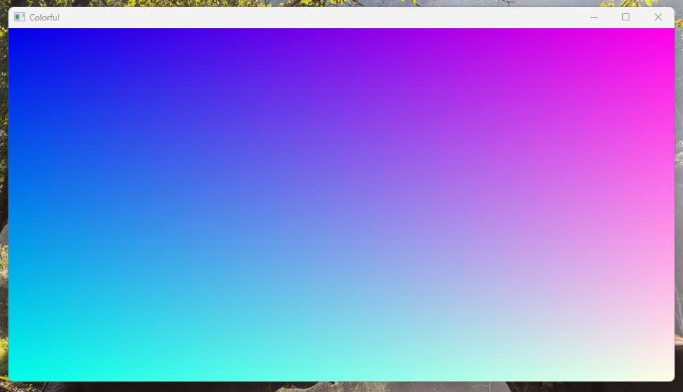
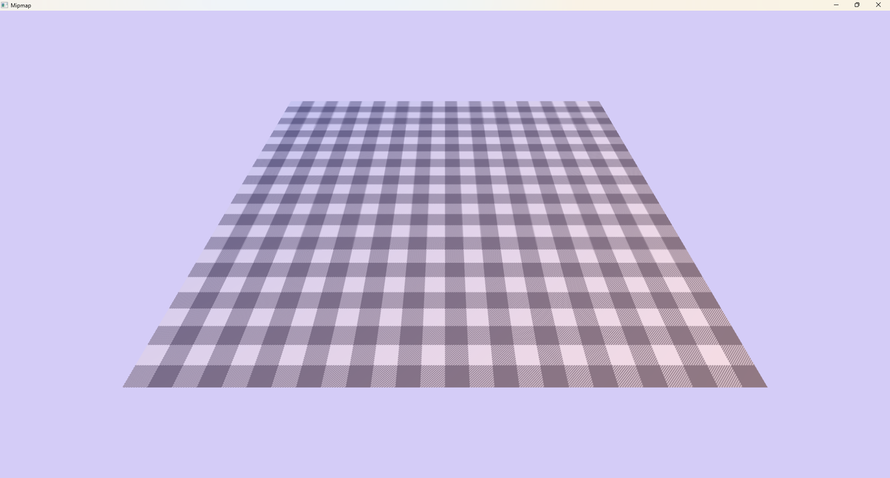

# Coplt.Graphics

Render Hardware Interface designed for c#
- Use com style object
- Utf16 string support
- Try to avoid string passing
- Minimize native calls and use memory to transfer data in batches to reduce GC transitions
- Avoid pointer nesting as much as possible, as it will lead to difficult memory fixation and temporary heap allocation.（Name and criticize vulkan）
- Support new graphics features as much as possible, but CPU parallelism is not the focus. Heavy command filling should obviously not occur, and GPU-driven should be used

# Examples

|Preview|Name|Description|
|-|-|-|
||[Hello Triangle](./Examples/HelloTriangle/HelloTriangle.md)|The most basic usage, basic swap chain creation, pipeline creation. No any resources, including vertex buffers.|
||[Hello Triangle Vertex](./Examples/HelloTriangleVertex/HelloTriangleVertex.md)|Demonstrates the use of vertex buffers.|
||[Colorful](./Examples/Colorful/Colorful.md)|Demonstrates the use of shader binding.|
||[Image](./Examples/Image/Image.md)|Demonstrates the use of image load, upload and sampler.|
||[Mipmap](./Examples/Mipmap/Mipmap.md)|Demonstrate the use of compute shaders and dynamic groups.|

# Build

- Requires .NET 9
- Requires Ninja
- Requires Clang 19, does not support msvc, gcc
